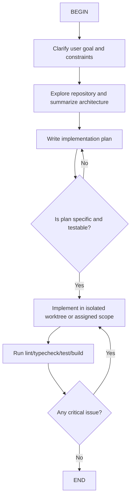

```mermaid
flowchart TD
  BEGIN --> interview[Clarify user goal and constraints]
  interview --> explore[Explore repository and summarize architecture]
  explore --> plan[Write implementation plan]
  plan --> gate{Is plan specific and testable?}
  gate -->|No| plan
  gate -->|Yes| implement[Implement in isolated worktree or assigned scope]
  implement --> test[Run lint/typecheck/test/build]
  test --> review{Any critical issue?}
  review -->|Yes| implement
  review -->|No| END
```
