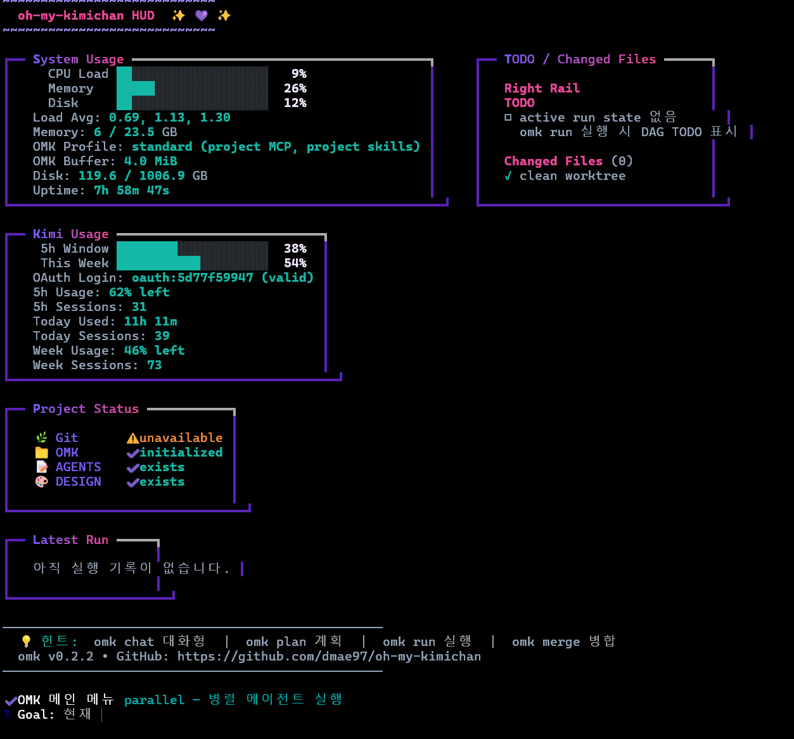
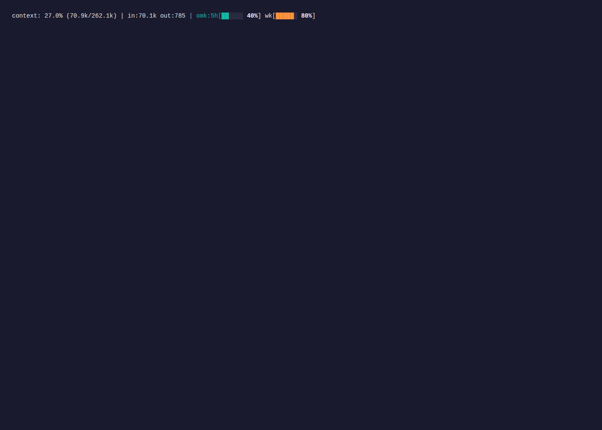
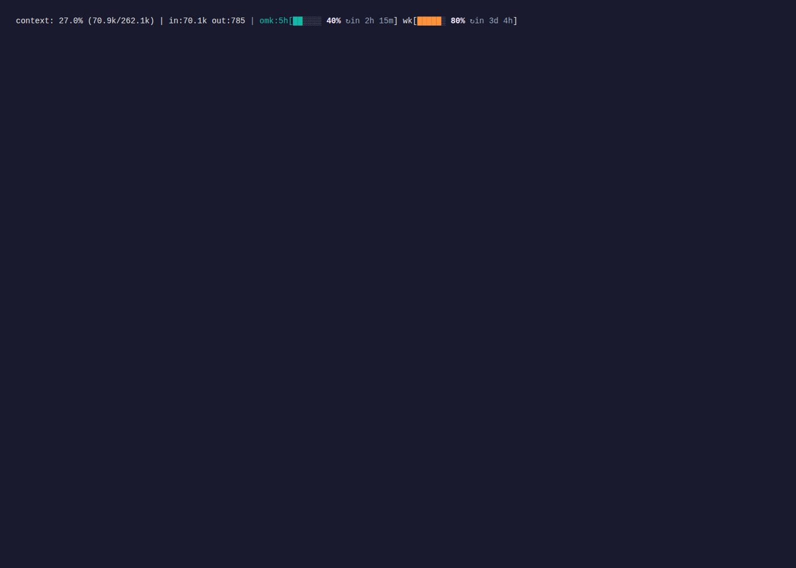
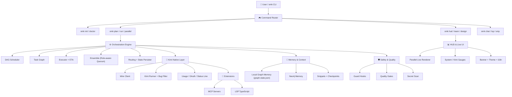

<div align="center">


<h1>oh-my-kimichan</h1>

<p>
  <strong>Turn Kimi Code CLI into a worktree-based coding team</strong><br/>
  <sub>Multi-agent orchestration harness / DESIGN.md-aware UI / Live quality gates / AGENTS.md compatible</sub>
</p>

<p>
  <a href="https://github.com/dmae97/oh-my-kimichan/actions/workflows/ci.yml"></a>
  <a href="https://github.com/dmae97/oh-my-kimichan/releases"></a>
  <a href="https://www.npmjs.com/package/oh-my-kimichan"></a>
  <a href="https://www.npmjs.com/package/oh-my-kimichan"></a>
  <a href="https://github.com/dmae97/oh-my-kimichan/stargazers"></a>
  <a href="https://github.com/dmae97/oh-my-kimichan/network/members"></a>
  <a href="https://github.com/dmae97/oh-my-kimichan/issues"></a>
  <a href="./LICENSE"></a>
</p>

<p>
  
  
  
  
  
</p>

<p>
  <a href="#korean">Korean</a> /
  <a href="#english">English</a> /
  <a href="#chinese">Chinese</a> /
  <a href="#japanese">Japanese</a>
</p>

</div>

---

## Table of Contents

- [GitHub Release Snapshot](#github-release-snapshot)
- [Repository Topics](#repository-topics)
- [Korean](#korean)
- [English](#english)
- [Chinese](#chinese)
- [Japanese](#japanese)
- [Customization](#customization)
- [Acknowledgements](#acknowledgements)

---

## GitHub Release Snapshot

> **Current GitHub-ready version:** `0.3.0`

### What's New in v0.3.0

| **Area** | **GitHub-visible update** | **Why it matters** |
|----------|---------------------------|--------------------|
| **Core Engine** | `omk parallel <goal>` — coordinator → worker fan-out → reviewer with live ETA tracking | Spin up a multi-agent team from a single goal with real-time progress |
| **Core Engine** | Enhanced DAG engine with priority, cost, routing, `failurePolicy`, and evidence gates per node | Production-grade orchestration: retries, fallbacks, and I/O validation |
| **Core Engine** | Role-aware ensemble — coder/planner/architect/reviewer/QA/explorer with weighted candidates + quorum aggregation | Improves agent-call quality while keeping `max_parallel = 1` by default |
| **Core Engine** | `omk run --run-id <id>` resumes persisted run state | Long-running agent tasks survive restarts and context switches |
| **Core Engine** | `SendDMail` checkpoint helpers + `.omk/snippets/` reusable storage | Safer refactors and reusable code blocks across agent sessions |
| **UI/UX** | `omk hud` — live dashboard with System Usage, Kimi Usage gauges, Project Status, Latest Run, TODO & Changed Files sidebar | Real-time visibility into your agent fleet without external monitoring tools |
| **UI/UX** | Bare `omk` TTY entry point — HUD + interactive `@inquirer/prompts` menu | Zero-config entry point for new users; no more "what do I type first?" |
| **UI/UX** | `ParallelLiveRenderer` refreshes every 1.5 s with run state transitions | See workers start, finish, fail, and retry in real time |
| **UI/UX** | `OMK_KIMI_STATUS_GAUGES=1` enables visual bar gauges for 5 h/weekly quota | Know your Kimi API budget at a glance |
| **UI/UX** | `OMK_STAR_PROMPT` guided GitHub star experience on first CLI use | Community growth without being intrusive; respects `CI` and `--help` |
| **Memory & Intelligence** | Local graph memory — `.omk/memory/graph-state.json` with ontology mindmap and GraphQL-lite recall | Local-first memory works without external Neo4j setup |
| **Memory & Intelligence** | `omk lsp typescript` exposes the bundled TypeScript language server | Helps coding agents and editors share the same language intelligence |
| **Memory & Intelligence** | I18n utilities added for multi-language agent workflows | Foundation for localized agent prompts and CLI output |
| **Safety & Quality** | `stop-verify.sh` comprehensive verification + eslint + hardened path validation | Even in `yolo` mode, destructive commands and credential exposure are blocked |
| **Safety & Quality** | `runtime.resource_profile = "auto"` selects lite profile on 16 GB machines | Keeps OMK usable on 16 GB laptops and WSL environments |
| **Safety & Quality** | `npm run check`, `npm test`, `npm run lint`, `npm run build` wired into CI | GitHub contributors can verify changes before PRs |
| **Assets** | 5 new PNG screenshots: `omk-hud-1.png`, `omk-hud-screenshot.png`, `omk-statusline-gauge.png`, `omk-statusline-reset.png`, `readme-in.png` | Rich visual documentation for the GitHub landing page |

### GitHub Markdown checklist

- [x] GitHub Actions / package version / npm / stars / forks / issues badges are visible at the top.
- [x] Mermaid architecture diagrams render in GitHub-flavored Markdown.
- [x] Repository topic badges below match the recommended GitHub topics.
- [x] README logo PNG display width increased to `720 px` for a stronger GitHub landing page.
- [x] Screenshots for HUD, parallel UI, and status-line gauges are embedded with alt text.
- [x] I18n utilities and multi-language README sections are present.
- [x] New PNG assets (`omk-hud-1.png`, `omk-statusline-gauge.png`, `readme-in.png`, etc.) are included in the repo.

## Repository Topics

These topics are also mirrored in `package.json` keywords for npm/GitHub discoverability.

<p>
  
  
  
  
  
  
  
  
  
  
  
  
  
  
  
  
  
  
  
  
</p>

Recommended GitHub topics:

```txt
kimi, kimi-cli, kimi-code, kimi-k2, ai-agent, coding-agent, multi-agent, agentic-coding, orchestration, dag, task-graph, ensemble, mcp, model-context-protocol, lsp, typescript, nodejs, cli, developer-tools, worktree
```

---

<h2 id="korean">Korean</h2>

> Kimi Code CLI를 <strong>worktree 기반 코딩 팀</strong>으로 변환하세요. DESIGN.md 기반 UI 생성, AGENTS.md 호환성, 실시간 품질 게이트를 제공합니다.

### Features

| Feature | Description |
|---------|-------------|
| Kimi K2.6 Optimized | Kimi K2.6에 특화된 워크플로우와 컨텍스트 관리 |
| Okabe + D-Mail | Kimi Code의 Okabe 스마트 컨텍스트 관리와 `SendDMail` 체크포인트 기본 활용 |
| Worktree-based Parallel Team | Git worktree로 에이전트별 격리된 작업 공간 제공 |
| DESIGN.md Integration | Google DESIGN.md 표준 기반 UI 생성 |
| Multi-Agent Compatible | AGENTS.md / GEMINI.md / CLAUDE.md 동시 지원 |
| Quality Gates | 완료 전 자동 lint, typecheck, test, build 검증 |
| Built-in LSP | `omk lsp typescript`로 번들 TypeScript language server 실행 |
| Live HUD | System Usage / Kimi Usage gauges / Project Status / Latest Run / TODO & Changed Files 사이드바를 포함한 실시간 대시보드 |
| MCP Integration | 다양한 MCP 서버와의 원활한 연동 |
| Local Graph Memory | 프로젝트/세션별 기억을 `.omk/memory/graph-state.json` 온톨로지 그래프로 저장하고 mindmap/GraphQL-lite 제공 |
| OAuth Usage Badge | Kimi `context:` 상태줄 옆에 masked 계정, 5h/weekly quota 표시; `OMK_KIMI_STATUS_GAUGES=1`로 시각적 게이지 활성화 |
| YOLO-by-default | 오픈소스 기본값은 `approval_policy = "yolo"`; secret/destructive hooks는 계속 차단 |
| Safety Hooks | yolo mode에서도 파괴적 명령어 및 비밀 유출 방지 기본 제공 |

### 🆕 v0.3.0 Highlights

- **`omk parallel <goal>`** — coordinator → worker fan-out → reviewer 패턴으로 병렬 에이전트 팀 구성, 실시간 ETA 추적
- **`omk hud` 대시보드** — System Usage / Kimi Usage 게이지, Project Status, TODO & Changed Files 사이드바를 포함한 실시간 터미널 대시보드
- **TTY 인터랙티브 메뉴** — `omk` 단독 실행 시 HUD + `@inquirer/prompts` 메뉴 자동 실행
- **`--run-id` 실행 재개** — 이전 실행 상태를 `.omk/runs/`에서 복원하여 장기 작업도 안전하게 이어감
- **SendDMail 체크포인트 + Snippets** — 리팩토링 전 D-Mail 체크포인트 저장 및 `.omk/snippets/` 코드 블록 재사용
- **OAuth Usage Gauges** — `OMK_KIMI_STATUS_GAUGES=1`로 5시간/주간 할당량 시각적 게이지 활성화
- **16GB-friendly Runtime** — 메모리 자동 감지 후 lite 프로파일 전환, 저사양 노트북/WSL 지원
- **역할 기반 앙상블** — coder/planner/architect/reviewer/QA/explorer 가중 후보 + 쿼럼 집계
- **로컬 그래프 메모리** — `.omk/memory/graph-state.json` 온톨로지 그래프 + mindmap/GraphQL-lite
- **내장 LSP** — `omk lsp typescript`로 TypeScript language server 바로 실행
- **품질 게이트 강화** — `npm run check/test/lint/build`를 CI와 릴리스 체크에 연동
- **신규 PNG 에셋** — HUD, 상태줄 게이지, 대시보드 스크린샷 등 5종 추가

### Install

```bash
npm install -g oh-my-kimichan
```

> **Requirements:** Node.js >= 20, Git, python3, Kimi CLI (v1.39.0+)

### Quick Start

```bash
omk init
omk doctor
omk chat
```

### Kimi-native context

oh-my-kimichan agents use an Okabe-compatible base agent that inherits `default` and adds `SendDMail`, so D-Mail is available for checkpoint rollback and context recovery. Use it before risky refactors, long-running handoffs, or `/compact`; durable facts still go to project-local ontology graph memory.

### Project-local graph memory

OMK stores project/session memory in `.omk/memory/graph-state.json` by default, decomposes notes into ontology nodes (`Goal`, `Decision`, `Task`, `Risk`, `Command`, `File`, `Evidence`, `Concept`), and exposes `omk_memory_mindmap` plus `omk_graph_query` for GraphQL-lite access. External Neo4j remains optional.

The interactive wrapper also augments Kimi’s native `context:` status line with a masked OAuth account plus 5-hour and weekly usage/quota. See `docs/kimi-oauth-usage-status.md`.


### Preview

#### Live HUD (`omk hud`)



#### Kimi Status Line with Usage Gauges

OMK augments Kimi’s native `context:` status line with masked OAuth account + 5h/weekly quota. Set `OMK_KIMI_STATUS_GAUGES=1` for visual bar gauges.




```bash
$ omk doctor
OK Node.js           v22.14.0
OK Git               2.49.0
OK Python            3.13.2
OK tmux              3.5a
OK Kimi CLI          v1.39.0
OK Scaffold          .omk/, .kimi/skills/ found

$ omk parallel "refactor auth module"
Parallel Execution
Run ID:   2025-05-01T12-34-56
Goal:     refactor auth module
Workers:  3
✔ Parallel DAG run complete

$ omk team
Team Runtime starting...
   [architect]  Creating plan.md...
   [coder]      Implementation in progress...
   [reviewer]   Code review done
   [qa]         Tests passed
```

### CLI Commands

#### Stable

| Command | Description |
|---------|-------------|
| `omk init` | Scaffold .omk/, .kimi/skills/, .agents/skills/, docs, hooks, agents |
| `omk doctor` | Check Node, Kimi CLI, Git, python3, tmux, scaffold |
| `omk chat` | Interactive Kimi with agent/config/MCP auto-detection |
| `omk plan <goal>` | Plan-only mode |
| `omk run <flow> <goal>` | Flow-based task execution |
| `omk parallel <goal>` | Parallel DAG execution (coordinator → workers → reviewer) |
| `omk hud` | Live dashboard with system usage, Kimi quota, project status, run tracking |
| `omk lsp [server]` | Built-in LSP launcher; default server is TypeScript |
| `omk design init` | Create DESIGN.md with frontmatter |
| `omk design list` | List local/remote DESIGN.md files |
| `omk design apply <name>` | Convert DESIGN.md into code |
| `omk google stitch-install` | Install Google Stitch skills |
| `omk sync` | Sync Kimi assets |

#### Experimental

| Command | Status | Notes |
|---------|--------|-------|
| `omk team` | Layout only | tmux window layout scaffold |
| `omk merge` | Manual | Diff check + manual cherry-pick guidance |
| `omk design lint` | Stub | Validation not yet implemented |
| `omk design diff` | Stub | Diff not yet implemented |
| `omk design export` | Stub | Export not yet implemented |

### 🏗️ 아키텍처



### 🛡️ 안전

기본 훅은 파괴적 명령과 비밀 유출을 차단합니다:

- `.omk/config.toml`의 기본 approval policy는 오픈소스 자동화를 위해 `yolo`입니다.
- `pre-shell-guard.sh` — `rm -rf /`, `sudo`, `git push --force` 등 차단
- `protect-secrets.sh` — `.env` 편집 및 비밀 유출 차단
- `post-format.sh` — 수정된 파일 자동 포맷
- `stop-verify.sh` — 종료 시 최종 검증

### 🔌 내장 LSP

```bash
omk lsp --print-config
omk lsp --check
omk lsp typescript
```

`omk init`은 `.omk/lsp.json`을 생성하고, TypeScript/JavaScript 프로젝트에서 사용할 수 있는 번들 `typescript-language-server` 실행 경로를 제공합니다.

### 📄 라이선스

[MIT](./LICENSE)

---

<h2 id="english">English</h2>

> Turn Kimi Code CLI into a <strong>worktree-based coding team</strong> with DESIGN.md-aware UI generation, AGENTS.md compatibility, and live quality gates.

### Features

| Feature | Description |
|---------|-------------|
| Kimi K2.6 Optimized | Workflows and context management tailored for Kimi K2.6 |
| Okabe + D-Mail | Uses Kimi Code Okabe smart context management and `SendDMail` checkpoint recovery by default |
| Worktree-based Parallel Team | Git worktree provides isolated workspaces per agent |
| DESIGN.md Integration | UI generation based on Google DESIGN.md standard |
| Multi-Agent Compatible | Simultaneous support for AGENTS.md / GEMINI.md / CLAUDE.md |
| Quality Gates | Automated lint, typecheck, test, build verification before completion |
| Live HUD | Real-time dashboard with System Usage, Kimi Usage gauges, Project Status, Latest Run, and TODO / Changed Files sidebar |
| MCP Integration | Seamless connection with various MCP servers |
| Local Graph Memory | Stores project/session memory in `.omk/memory/graph-state.json` as an ontology graph with mindmap/GraphQL-lite tools |
| Parallel DAG | `omk parallel <goal>` runs coordinator → worker fan-out → reviewer with live UI and ETA tracking |
| Safety Hooks | Default protection against destructive commands and secret leakage |

### 🆕 v0.3.0 Highlights

- **`omk parallel <goal>`** — Run coordinator → worker fan-out → reviewer with live ETA tracking and 1.5 s UI refresh
- **`omk hud` dashboard** — Real-time terminal dashboard with System / Kimi Usage gauges, Project Status, TODO & Changed Files sidebar
- **TTY interactive menu** — Bare `omk` launches HUD + `@inquirer/prompts` menu for zero-config onboarding
- **`--run-id` resume** — Restore any previous run from `.omk/runs/` persisted state
- **SendDMail checkpoints + Snippets** — Save D-Mail checkpoints before risky refactors and reuse code blocks via `.omk/snippets/`
- **OAuth Usage Gauges** — Visual bar gauges for 5 h/weekly quota via `OMK_KIMI_STATUS_GAUGES=1`
- **16 GB-friendly runtime** — Auto-detects memory and switches to lite profile for low-spec laptops / WSL
- **Role-aware ensemble** — Weighted candidate scoring + quorum aggregation across coder/planner/architect/reviewer/QA/explorer
- **Local graph memory** — Ontology graph in `.omk/memory/graph-state.json` with mindmap and GraphQL-lite recall
- **Built-in LSP** — `omk lsp typescript` bundles TypeScript language server out of the box
- **Quality gates wired to CI** — `npm run check / test / lint / build` enforced in CI and release checks
- **New PNG assets** — 5 screenshots added: HUD, status-line gauges, dashboard, and more

### Install

```bash
npm install -g oh-my-kimichan
```

> **Requirements:** Node.js >= 20, Git, python3, Kimi CLI (v1.39.0+)

### Quick Start

```bash
omk init
omk doctor
omk chat
```

### Preview

#### Live HUD (`omk hud`)


#### Kimi Status Line with Usage Gauges

OMK augments Kimi’s native `context:` status line with masked OAuth account + 5h/weekly quota. Set `OMK_KIMI_STATUS_GAUGES=1` for visual bar gauges.


```bash
$ omk doctor
OK Node.js           v22.14.0
OK Git               2.49.0
OK Python            3.13.2
OK tmux              3.5a
OK Kimi CLI          v1.39.0
OK Scaffold          .omk/, .kimi/skills/ found

$ omk parallel "refactor auth module"
Parallel Execution
Run ID:   2025-05-01T12-34-56
Goal:     refactor auth module
Workers:  3
✔ Parallel DAG run complete

$ omk team
Team Runtime starting...
   [architect]  Creating plan.md...
   [coder]      Implementation in progress...
   [reviewer]   Code review done
   [qa]         Tests passed
```

### CLI Commands

#### Stable

| Command | Description |
|---------|-------------|
| `omk init` | Scaffold .omk/, .kimi/skills/, .agents/skills/, docs, hooks, agents |
| `omk doctor` | Check Node, Kimi CLI, Git, python3, tmux, scaffold |
| `omk chat` | Interactive Kimi with agent/config/MCP auto-detection |
| `omk plan <goal>` | Plan-only mode |
| `omk run <flow> <goal>` | Flow-based task execution |
| `omk parallel <goal>` | Parallel DAG execution (coordinator → workers → reviewer) |
| `omk hud` | Live dashboard with system usage, Kimi quota, project status, run tracking |
| `omk design init` | Create DESIGN.md with frontmatter |
| `omk design list` | List local/remote DESIGN.md files |
| `omk design apply <name>` | Convert DESIGN.md into code |
| `omk google stitch-install` | Install Google Stitch skills |
| `omk sync` | Sync Kimi assets |

#### Experimental

| Command | Status | Notes |
|---------|--------|-------|
| `omk team` | Layout only | tmux window layout scaffold |
| `omk merge` | Manual | Diff check + manual cherry-pick guidance |
| `omk design lint` | Stub | Validation not yet implemented |
| `omk design diff` | Stub | Diff not yet implemented |
| `omk design export` | Stub | Export not yet implemented |

### 🏗️ Architecture


### 🛡️ Safety

Default hooks block destructive commands and secret leakage:

- `pre-shell-guard.sh` — Blocks `rm -rf /`, `sudo`, `git push --force`, etc.
- `protect-secrets.sh` — Blocks `.env` edits and secret leakage
- `post-format.sh` — Auto-formats modified files
- `stop-verify.sh` — Final verification on stop

### 📄 License

[MIT](./LICENSE)

---

<h2 id="chinese">Chinese</h2>

> 将 Kimi Code CLI 转变为一个<strong>基于 worktree 的编码团队</strong>。支持 DESIGN.md 感知 UI 生成、AGENTS.md 兼容性以及实时质量门禁。

### Features

| Feature | Description |
|---------|-------------|
| Kimi K2.6 优化 | 专为 Kimi K2.6 定制的工作流与上下文管理 |
| Okabe + D-Mail | 默认使用 Kimi Code Okabe 智能上下文管理和 `SendDMail` 检查点恢复 |
| 基于 Worktree 的并行团队 | Git worktree 为每个 Agent 提供隔离工作空间 |
| DESIGN.md 集成 | 基于 Google DESIGN.md 标准的 UI 生成 |
| 多 Agent 兼容 | 同时支持 AGENTS.md / GEMINI.md / CLAUDE.md |
| 质量门禁 | 完成前自动执行 lint、typecheck、test、build 验证 |
| 实时 HUD | 实时仪表盘：系统用量、Kimi 配额条、项目状态、最新运行、TODO / 变更文件侧边栏 |
| MCP 集成 | 与多种 MCP 服务器无缝连接 |
| Local Graph Memory | 将项目/会话记忆存入 `.omk/memory/graph-state.json` 本地本体图，并提供 mindmap/GraphQL-lite |
| 并行 DAG | `omk parallel <goal>` 执行 coordinator → worker 扇出 → reviewer，带实时 UI 与 ETA 追踪 |
| 安全钩子 | 默认防止破坏性命令与密钥泄漏 |

### 🆕 v0.3.0 更新亮点

- **`omk parallel <goal>`** — 协调器 → 多 Worker 分发 → Reviewer 闭环，支持实时 ETA 追踪与 1.5 秒 UI 刷新
- **`omk hud` 仪表盘** — 实时终端仪表盘：系统/Kimi 资源 gauges、项目状态、TODO & 变更文件侧边栏
- **TTY 交互式入口** — 直接执行 `omk` 即可唤起 HUD + 交互式菜单，零配置上
- **`--run-id` 运行恢复** — 从 `.omk/runs/` 持久化状态恢复任意历史运行
- **SendDMail 检查点 + Snippets** — 危险重构前保存 D-Mail 检查点，通过 `.omk/snippets/` 复用代码块
- **OAuth 用量可视化** — `OMK_KIMI_STATUS_GAUGES=1` 实时展示 API 配额与重置倒计时
- **16GB 友好运行时** — 自动检测内存并切换轻量资源画像，低内存设备流畅运行
- **角色感知型编排** — 加权候选者 + 仲裁投票机制覆盖 coder/planner/architect/reviewer/QA/explorer
- **本地图记忆** — `.omk/memory/graph-state.json` 本体图谱，支持 mindmap / GraphQL-lite 查询
- **内置 LSP** — `omk lsp typescript` 开箱即用 TypeScript 语言服务
- **CI 质量门禁** — `npm run check/test/lint/build` 全链路接入 CI 与发布检查
- **新增 PNG 截图** — HUD、状态栏 gauges、仪表盘等 5 张界面截图补充

### Install

```bash
npm install -g oh-my-kimichan
```

> **要求：** Node.js >= 20、Git、python3、Kimi CLI (v1.39.0+)

### Quick Start

```bash
omk init
omk doctor
omk chat
```

### Preview

#### Live HUD (`omk hud`)


#### Kimi Status Line with Usage Gauges

OMK augments Kimi’s native `context:` status line with masked OAuth account + 5h/weekly quota. Set `OMK_KIMI_STATUS_GAUGES=1` for visual bar gauges.


```bash
$ omk doctor
OK Node.js           v22.14.0
OK Git               2.49.0
OK Python            3.13.2
OK tmux              3.5a
OK Kimi CLI          v1.39.0
OK Scaffold          .omk/, .kimi/skills/ found

$ omk parallel "refactor auth module"
Parallel Execution
Run ID:   2025-05-01T12-34-56
Goal:     refactor auth module
Workers:  3
✔ Parallel DAG run complete

$ omk team
Team Runtime 启动中...
   [architect]  创建 plan.md...
   [coder]      实现进行中...
   [reviewer]   代码审查完成
   [qa]         测试通过
```

### CLI Commands

#### Stable

| Command | Description |
|---------|-------------|
| `omk init` | 创建 .omk/、.kimi/skills/、.agents/skills/、docs、hooks、agents 脚手架 |
| `omk doctor` | 检查 Node、Kimi CLI、Git、python3、tmux、脚手架 |
| `omk chat` | 支持代理/配置/MCP 自动检测的交互式 Kimi |
| `omk plan <goal>` | 仅计划模式 |
| `omk run <flow> <goal>` | 基于流程的任务执行 |
| `omk parallel <goal>` | 并行 DAG 执行（coordinator → workers → reviewer） |
| `omk hud` | 实时仪表盘：系统用量、Kimi 配额、项目状态、运行追踪 |
| `omk design init` | 创建带 frontmatter 的 DESIGN.md |
| `omk design list` | 列出本地/远程 DESIGN.md |
| `omk design apply <name>` | 将 DESIGN.md 转换为代码 |
| `omk google stitch-install` | 安装 Google Stitch 技能 |
| `omk sync` | 同步 Kimi 资源 |

#### Experimental

| Command | Status | Notes |
|---------|--------|-------|
| `omk team` | 仅布局 | tmux 窗口布局脚手架 |
| `omk merge` | 手动 | Diff 检查 + 手动 cherry-pick 指导 |
| `omk design lint` | 占位 | 验证尚未实现 |
| `omk design diff` | 占位 | Diff 尚未实现 |
| `omk design export` | 占位 | 导出尚未实现 |

### 🏗️ 架构


### 🛡️ 安全

默认钩子阻止破坏性命令和密钥泄漏：

- `pre-shell-guard.sh` — 阻止 `rm -rf /`、`sudo`、`git push --force` 等
- `protect-secrets.sh` — 阻止 `.env` 编辑及密钥泄漏
- `post-format.sh` — 自动格式化修改的文件
- `stop-verify.sh` — 停止时的最终验证

### 📄 许可证

[MIT](./LICENSE)

---

<h2 id="japanese">Japanese</h2>

> Kimi Code CLI を <strong>worktree ベースのコーディングチーム</strong>に変換します。DESIGN.md 対応の UI 生成、AGENTS.md 互換性、ライブ品質ゲートを提供します。

### Features

| Feature | Description |
|---------|-------------|
| Kimi K2.6 対応 | Kimi K2.6 に特化したワークフローとコンテキスト管理 |
| Okabe + D-Mail | Kimi Code Okabe のスマートコンテキスト管理と `SendDMail` チェックポイント復旧を標準利用 |
| Worktree ベース並列チーム | Git worktree でエージェントごとに分離された作業空間を提供 |
| DESIGN.md 連携 | Google DESIGN.md 標準に基づく UI 生成 |
| マルチエージェント互換 | AGENTS.md / GEMINI.md / CLAUDE.md を同時サポート |
| 品質ゲート | 完了前に自動 lint、typecheck、test、build を検証 |
| ライブ HUD | リアルタイムダッシュボード：システム使用量、Kimi クォータゲージ、プロジェクト状態、最新実行、TODO / 変更ファイルサイドバー |
| MCP 統合 | 様々な MCP サーバーとのシームレスな連携 |
| Local Graph Memory | プロジェクト/セッション記憶を `.omk/memory/graph-state.json` のローカル ontology graph に保存し、mindmap/GraphQL-lite を提供 |
| 並列 DAG | `omk parallel <goal>` は coordinator → worker ファンアウト → reviewer を実行。ライブ UI と ETA 追跡付き |
| 安全フック | 破壊的コマンドとシークレット漏洩をデフォルトで防止 |

### 🆕 v0.3.0 の主な更新

- **`omk parallel <goal>`** — コーディネーター → Worker 分散 → Reviewer 集約。リアルタイム ETA 追跡と 1.5 秒間隔の UI 更新
- **`omk hud` ダッシュボード** — システム／Kimi のメーター、プロジェクト状態、TODO & 変更ファイルサイドバーを含むリアルタイムターミナルダッシュボード
- **TTY インタラクティブメニュー** — `omk` 単体実行で HUD + 対話型プロンプトを自動起動。設定不要ですぐに使える
- **`--run-id` 実行再開** — `.omk/runs/` の永続化状態から任意の過去実行を再開
- **SendDMail チェックポイント + Snippets** — 危険なリファクタ前に D-Mail チェックポイントを保存し、`.omk/snippets/` でコードブロックを再利用
- **OAuth 使用量ゲージ** — `OMK_KIMI_STATUS_GAUGES=1` で API クォータとリセット残時間をステータスバーにリアルタイム表示
- **16GB メモリ対応ランタイム** — 搭載メモリを自動検出し軽量プロファイルに切り替え。低スペック環境でも快適に動作
- **役割認識型アンサンブル** — 重み付き候補＋クォーラム投票を coder/planner/architect/reviewer/QA/explorer で実現
- **ローカルグラフメモリ** — `.omk/memory/graph-state.json` オントロジーで知識を構造化。mindmap / GraphQL-lite 対応
- **組み込み LSP** — `omk lsp typescript` で TypeScript 言語サーバーを即座に利用可能
- **CI 品質ゲート** — `npm run check/test/lint/build` を CI とリリースチェックに統合
- **新規スクリーンショット** — HUD、ステータスバー gauges、ダッシュボードなど 5 点の UI スクリーンショットを追加

### Install

```bash
npm install -g oh-my-kimichan
```

> **要件:** Node.js >= 20、Git、python3、Kimi CLI (v1.39.0+)

### Quick Start

```bash
omk init
omk doctor
omk chat
```

### Preview

#### Live HUD (`omk hud`)


#### Kimi Status Line with Usage Gauges

OMK augments Kimi’s native `context:` status line with masked OAuth account + 5h/weekly quota. Set `OMK_KIMI_STATUS_GAUGES=1` for visual bar gauges.


```bash
$ omk doctor
OK Node.js           v22.14.0
OK Git               2.49.0
OK Python            3.13.2
OK tmux              3.5a
OK Kimi CLI          v1.39.0
OK Scaffold          .omk/, .kimi/skills/ found

$ omk parallel "refactor auth module"
Parallel Execution
Run ID:   2025-05-01T12-34-56
Goal:     refactor auth module
Workers:  3
✔ Parallel DAG run complete

$ omk team
Team Runtime 開始中...
   [architect]  plan.md 作成中...
   [coder]      実装進行中...
   [reviewer]   コードレビュー完了
   [qa]         テスト通過
```

### CLI Commands

#### Stable

| Command | Description |
|---------|-------------|
| `omk init` | .omk/、.kimi/skills/、.agents/skills/、docs、hooks、agents のスキャフォールドを作成 |
| `omk doctor` | Node、Kimi CLI、Git、python3、tmux、スキャフォールドを診断 |
| `omk chat` | エージェント/設定/MCP 自動検出対応の対話型 Kimi |
| `omk plan <goal>` | 計画専用モード |
| `omk run <flow> <goal>` | フローベースのタスク実行 |
| `omk parallel <goal>` | 並列 DAG 実行（coordinator → workers → reviewer） |
| `omk hud` | リアルタイムダッシュボード：システム使用量、Kimi クォータ、プロジェクト状態、実行追跡 |
| `omk design init` | frontmatter 付き DESIGN.md を作成 |
| `omk design list` | ローカル/リモート DESIGN.md を一覧表示 |
| `omk design apply <name>` | DESIGN.md をコードに変換適用 |
| `omk google stitch-install` | Google Stitch スキルをインストール |
| `omk sync` | Kimi アセットを同期 |

#### Experimental

| Command | Status | Notes |
|---------|--------|-------|
| `omk team` | レイアウトのみ | tmux ウィンドウ レイアウト スキャフォールド |
| `omk merge` | 手動 | Diff 確認 + 手動 cherry-pick ガイダンス |
| `omk design lint` | スタブ | 検証は未実装 |
| `omk design diff` | スタブ | Diff は未実装 |
| `omk design export` | スタブ | エクスポートは未実装 |

### 🏗️ アーキテクチャ


### 🛡️ セーフティ

デフォルトのフックは破壊的コマンドとシークレットの漏洩をブロックします：

- `pre-shell-guard.sh` — `rm -rf /`、`sudo`、`git push --force` などをブロック
- `protect-secrets.sh` — `.env` の編集とシークレットの漏洩をブロック
- `post-format.sh` — 変更ファイルの自動フォーマット
- `stop-verify.sh` — 停止時の最終検証

### 📄 ライセンス

[MIT](./LICENSE)

---

<h2 id="customization">Customization</h2>

### 🎨 Custom Welcome Banner Image

You can override Kimi CLI's default ASCII banner with your own image:

1. Place your image in the project root (e.g. `kimichan.png`).
2. Add to `.omk/config.toml`:

```toml
[theme]
logo_image = "kimichan.png"
```

- Supports **PNG**, **JPEG**, and **GIF**.
- Relative paths are resolved from the project root; absolute paths (including Windows `C:\...` or `M:\...`) work too.
- In **iTerm**, **Kitty**, **WezTerm**, and other graphics-capable terminals, the image renders in full resolution.
- In standard terminals, it falls back to high-quality ANSI block art via `terminal-image`.
- If the image is missing or rendering fails, the built-in ASCII art is used automatically.

---

<h2 id="acknowledgements">Acknowledgements</h2>

This project stands on the shoulders of giants. Every line of code here is possible because of the relentless dedication of open-source contributors around the world. With deepest respect and gratitude:

### Core Platform & AI
- **[Kimi Code CLI](https://github.com/moonshot-ai/kimi-cli)** by Moonshot AI — The foundation that makes everything possible. Without Kimi K2.6 and its brilliant native agent runtime, `oh-my-kimichan` would not exist. Thank you for pushing the boundary of AI-native coding.
- **[Google DESIGN.md](https://design.md)** — For establishing a design-specification standard that bridges the gap between design intent and generated UI. A north star for structured frontend workflows.

### Language & Runtime
- **[TypeScript](https://www.typescriptlang.org/)** by Microsoft — For bringing sanity, safety, and stellar IDE experience to JavaScript at scale. The type system is the unsung hero of every refactor in this codebase.
- **[Node.js](https://nodejs.org/)** by the OpenJS Foundation — For the runtime that powers CLI tools, async I/O, and the entire npm ecosystem. Still the most versatile server-side JavaScript runtime on the planet.

### CLI & Developer Experience
- **[Commander.js](https://github.com/tj/commander.js)** by TJ Holowaychuk and contributors — The gold standard for building elegant, self-documenting command-line interfaces in Node.js.
- **[@inquirer/prompts](https://github.com/SBoudrias/Inquirer.js)** by Simon Boudrias — For beautiful, accessible, and keyboard-friendly interactive prompts. The TTY menu experience in `omk` is built on this.
- **[execa](https://github.com/sindresorhus/execa)** by Sindre Sorhus — For making child-process execution predictable, promise-friendly, and cross-platform. Every shell-out in OMK goes through this.
- **[tsx](https://github.com/privatenumber/tsx)** by Anthony Fu — For zero-config TypeScript execution during development. `npm run dev` simply works, and that magic matters.

### Data Validation & Parsing
- **[Zod](https://zod.dev/)** by Colin McDonnell — For TypeScript-first schema validation that feels like part of the language. Runtime safety without sacrificing developer ergonomics.
- **[yaml](https://github.com/eemeli/yaml)** by Eemeli Aro — For robust YAML parsing and stringifying. Agent configs, memory files, and CI definitions all rely on this.

### Filesystem & Terminal
- **[fs-extra](https://github.com/jprichardson/node-fs-extra)** by JP Richardson — For the filesystem utilities Node.js should have had from day one. Copy, move, ensureDir — all battle-tested.
- **[terminal-image](https://github.com/sindresorhus/terminal-image)** by Sindre Sorhus — For rendering images inside terminal emulators. The custom banner feature in OMK owes its magic to this.
- **[node-pty](https://github.com/microsoft/node-pty)** by Microsoft — For pseudo-terminal bindings that make interactive shell sessions feel native inside Node.js.
- **[tmux](https://github.com/tmux/tmux)** by Nicholas Marriott and contributors — The timeless terminal multiplexer. Team-runtime window layouts and long-lived agent sessions wouldn't be the same without it.

### Language Server & Graph Database
- **[typescript-language-server](https://github.com/typescript-language-server/typescript-language-server)** by TypeFox — For bundling a standards-compliant LSP that gives coding agents the same intelligence as VS Code.
- **[neo4j-driver](https://github.com/neo4j/neo4j-javascript-driver)** by Neo4j, Inc. — For making graph-database connectivity a first-class citizen in JavaScript. Optional in OMK, but powerful when enabled.

### Version Control & Collaboration
- **[Git](https://git-scm.com/)** by Linus Torvalds and the Git community — For the distributed version control system that enables worktrees, branches, and every merge strategy in OMK.
- **[GitHub](https://github.com/)** — For the platform that hosts this project, runs our CI, and connects maintainers with contributors across the globe.

### Inspiration & Community
- **[OpenCode](https://github.com/opencode)** and the broader agentic-coding community — For proving that AI-native development workflows are not just possible, but inevitable. Your early experiments with autonomous coding agents lit the path.
- **Creators of `oh-my-opencode`, `oh-my-claude`, and `oh-my-codex`** — For showing that every major AI coding assistant deserves its own ergonomic harness. Your pioneering work inspired the architecture and philosophy behind `oh-my-kimichan`.
- **The Kimi engineering team at Moonshot AI** — For building not just a model, but a complete native agent runtime with Okabe context management, D-Mail checkpoints, SendDMail recovery, and subagent orchestration. You redefined what a coding assistant can be.

---

> *"오픈소스는 코드가 아니라 사람들의 연대입니다. — Open source is not code; it is solidarity among people."*

<div align="center">
  <sub>Built with love for the Kimi ecosystem. 🙇 Respect to every maintainer, contributor, and issue reporter who makes open source possible.</sub>
</div>
