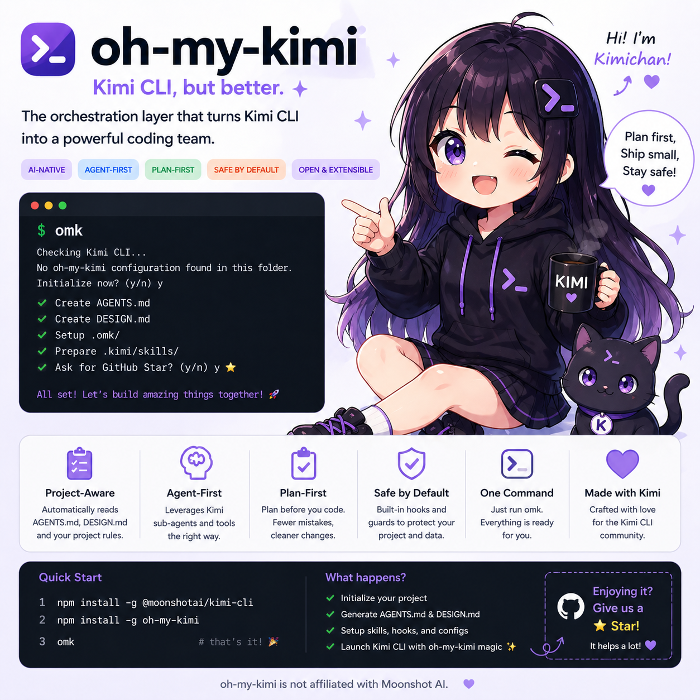
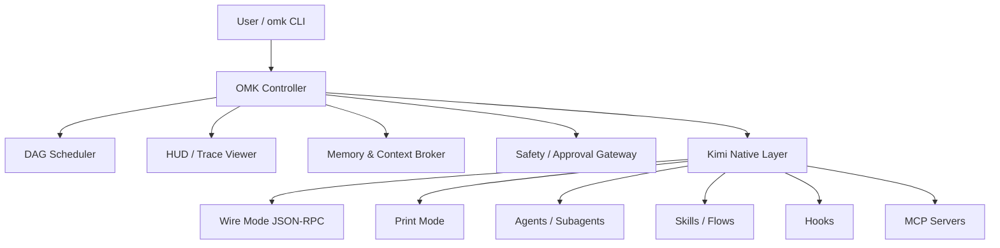

<div align="center">
  
  <h1>oh-my-kimichan</h1>
  <p><strong>Kimi is the agent. oh-my-kimichan is the team runtime.</strong></p>

  <p>
    <a href="https://www.npmjs.com/package/oh-my-kimichan"></a>
    <a href="./LICENSE"></a>
    <a href="https://github.com/dmae97/oh-my-kimichan/actions/workflows/ci.yml"></a>
    =20" />
    <a href="https://github.com/dmae97/oh-my-kimichan/issues"></a>
    <a href="https://github.com/dmae97/oh-my-kimichan/stargazers"></a>
  </p>

  <p>
    <a href="#-한국어">🇰🇷 한국어</a> •
    <a href="#-english">🇺🇸 English</a> •
    <a href="#-简体中文">🇨🇳 简体中文</a> •
    <a href="#-日本語">🇯🇵 日本語</a>
  </p>
</div>

---

## 📑 목차 / Table of Contents / 目录 / 目次

- [🇰🇷 한국어](#-한국어)
- [🇺🇸 English](#-english)
- [🇨🇳 简体中文](#-简体中文)
- [🇯🇵 日本語](#-日本語)

---

## 🇰🇷 한국어

> [Kimi Code CLI](https://github.com/MoonshotAI/kimi-cli)를 **worktree 기반 코딩 팀**으로 변환하세요. DESIGN.md 기반 UI 생성, AGENTS.md 호환성, 실시간 품질 게이트를 제공합니다.

### ✨ 주요 기능

- 🧠 Kimi K2.6 최적화 워크플로우
- 🌲 Worktree 기반 병렬 코딩 팀
- 🎨 [Google DESIGN.md](https://github.com/google-labs-code/design.md) 연동
- 📄 AGENTS.md / GEMINI.md / CLAUDE.md 호환
- 🛡️ 완료 전 품질 게이트
- 📊 실시간 HUD (작업자, 테스트, 리스크, 병합 상태)

### 🚀 설치

```bash
npm install -g oh-my-kimichan
```

> **요구사항:** Node.js >= 20, Git, python3, Kimi CLI (v1.39.0+)

### ⚡ 빠른 시작

```bash
# 1. 프로젝트 스캐폴드 생성
omk init

# 2. 환경 진단
omk doctor

# 3. 대화형 Kimi 실행
omk chat
```

### 📋 CLI 명령어

#### ✅ 안정

| 명령어 | 설명 |
|--------|------|
| `omk init` | `.omk/`, `.kimi/skills/`, `.agents/skills/`, docs, hooks, agents 스캐폴드 생성 |
| `omk doctor` | Node, Kimi CLI, Git, python3, tmux, scaffold 진단 |
| `omk chat` | 에이전트/설정/MCP 자동 탐지 대화형 Kimi |
| `omk plan <목표>` | 계획 전용 모드 |
| `omk run <플로우> <목표>` | 플로우 기반 작업 실행 |
| `omk design init` | frontmatter가 포함된 DESIGN.md 생성 |
| `omk google stitch-install` | Google Stitch 스킬 설치 |
| `omk sync` | Kimi 에셋 동기화 |

#### 🧪 실험적

| 명령어 | 상태 | 비고 |
|--------|------|------|
| `omk team` | 레이아웃만 | tmux 창 레이아웃 스캐폴드 |
| `omk merge` | 수동 | Diff 확인 + 수동 cherry-pick 안내 |
| `omk hud` | 부분 | 실행 상태 표시 |
| `omk design lint` | 스텁 | 유효성 검사 미구현 |
| `omk design diff` | 스텁 | Diff 미구현 |
| `omk design export` | 스텁 | 낳지 미구현 |

### 🏗️ 아키텍처



### 🛡️ 안전

기본 훅은 파괴적 명령과 비밀 유출을 차단합니다:

- `pre-shell-guard.sh` — `rm -rf /`, `sudo`, `git push --force` 등 차단
- `protect-secrets.sh` — `.env` 편집 및 비밀 유출 차단
- `post-format.sh` — 수정된 파일 자동 포맷
- `stop-verify.sh` — 종료 시 최종 검증

### 📄 라이선스

[MIT](./LICENSE)

---

## 🇺🇸 English

> Turn [Kimi Code CLI](https://github.com/MoonshotAI/kimi-cli) into a **worktree-based coding team** with DESIGN.md-aware UI generation, AGENTS.md compatibility, and live quality gates.

### ✨ Features

- 🧠 Kimi K2.6-aware workflows
- 🌲 Worktree-based parallel coding team
- 🎨 [Google DESIGN.md](https://github.com/google-labs-code/design.md) integration
- 📄 AGENTS.md / GEMINI.md / CLAUDE.md compatibility
- 🛡️ Quality gates before completion
- 📊 Live HUD for workers, tests, risk, and merge state

### 🚀 Install

```bash
npm install -g oh-my-kimichan
```

> **Requirements:** Node.js >= 20, Git, python3, Kimi CLI (v1.39.0+)

### ⚡ Quick Start

```bash
# 1. Scaffold your project
omk init

# 2. Check your environment
omk doctor

# 3. Start interactive Kimi
omk chat
```

### 📋 CLI Commands

#### ✅ Stable

| Command | Description |
|---------|-------------|
| `omk init` | Scaffold `.omk/`, `.kimi/skills/`, `.agents/skills/`, docs, hooks, agents |
| `omk doctor` | Check Node, Kimi CLI, Git, python3, tmux, scaffold |
| `omk chat` | Interactive Kimi with agent/config/MCP auto-detection |
| `omk plan <goal>` | Plan-only mode |
| `omk run <flow> <goal>` | Flow-based task execution |
| `omk design init` | Create DESIGN.md with frontmatter |
| `omk google stitch-install` | Install Google Stitch skills |
| `omk sync` | Sync Kimi assets |

#### 🧪 Experimental

| Command | Status | Notes |
|---------|--------|-------|
| `omk team` | Layout only | tmux window layout scaffold |
| `omk merge` | Manual | Diff check + manual cherry-pick guidance |
| `omk hud` | Partial | Run status display |
| `omk design lint` | Stub | Validation not yet implemented |
| `omk design diff` | Stub | Diff not yet implemented |
| `omk design export` | Stub | Export not yet implemented |

### 🏗️ Architecture


### 🛡️ Safety

Default hooks block destructive commands and secret leakage:

- `pre-shell-guard.sh` — Blocks `rm -rf /`, `sudo`, `git push --force`, etc.
- `protect-secrets.sh` — Blocks `.env` edits and secret leakage
- `post-format.sh` — Auto-formats modified files
- `stop-verify.sh` — Final verification on stop

### 📄 License

[MIT](./LICENSE)

---

## 🇨🇳 简体中文

> 将 [Kimi Code CLI](https://github.com/MoonshotAI/kimi-cli) 转变为一个**基于 worktree 的编码团队**。支持 DESIGN.md 感知 UI 生成、AGENTS.md 兼容性以及实时质量门禁。

### ✨ 主要功能

- 🧠 Kimi K2.6 优化工作流
- 🌲 基于 Worktree 的并行编码团队
- 🎨 [Google DESIGN.md](https://github.com/google-labs-code/design.md) 集成
- 📄 AGENTS.md / GEMINI.md / CLAUDE.md 兼容
- 🛡️ 完成前质量门禁
- 📊 实时 HUD（工作者、测试、风险、合并状态）

### 🚀 安装

```bash
npm install -g oh-my-kimichan
```

> **要求：** Node.js >= 20、Git、python3、Kimi CLI (v1.39.0+)

### ⚡ 快速开始

```bash
# 1. 创建项目脚手架
omk init

# 2. 环境诊断
omk doctor

# 3. 启动交互式 Kimi
omk chat
```

### 📋 CLI 命令

#### ✅ 稳定

| 命令 | 说明 |
|------|------|
| `omk init` | 创建 `.omk/`、`.kimi/skills/`、`.agents/skills/`、docs、hooks、agents 脚手架 |
| `omk doctor` | 检查 Node、Kimi CLI、Git、python3、tmux、脚手架 |
| `omk chat` | 支持代理/配置/MCP 自动检测的交互式 Kimi |
| `omk plan <目标>` | 仅计划模式 |
| `omk run <流程> <目标>` | 基于流程的任务执行 |
| `omk design init` | 创建带 frontmatter 的 DESIGN.md |
| `omk google stitch-install` | 安装 Google Stitch 技能 |
| `omk sync` | 同步 Kimi 资源 |

#### 🧪 实验性

| 命令 | 状态 | 备注 |
|------|------|------|
| `omk team` | 仅布局 | tmux 窗口布局脚手架 |
| `omk merge` | 手动 | Diff 检查 + 手动 cherry-pick 指导 |
| `omk hud` | 部分 | 运行状态显示 |
| `omk design lint` | 占位 | 验证尚未实现 |
| `omk design diff` | 占位 | Diff 尚未实现 |
| `omk design export` | 占位 | 导出尚未实现 |

### 🏗️ 架构


### 🛡️ 安全

默认钩子阻止破坏性命令和密钥泄漏：

- `pre-shell-guard.sh` — 阻止 `rm -rf /`、`sudo`、`git push --force` 等
- `protect-secrets.sh` — 阻止 `.env` 编辑及密钥泄漏
- `post-format.sh` — 自动格式化修改的文件
- `stop-verify.sh` — 停止时的最终验证

### 📄 许可证

[MIT](./LICENSE)

---

## 🇯🇵 日本語

> [Kimi Code CLI](https://github.com/MoonshotAI/kimi-cli) を **worktree ベースのコーディングチーム**に変換します。DESIGN.md 対応の UI 生成、AGENTS.md 互換性、ライブ品質ゲートを提供します。

### ✨ 主な機能

- 🧠 Kimi K2.6 対応ワークフロー
- 🌲 Worktree ベースの並列コーディングチーム
- 🎨 [Google DESIGN.md](https://github.com/google-labs-code/design.md) 連携
- 📄 AGENTS.md / GEMINI.md / CLAUDE.md 互換
- 🛡️ 完了前品質ゲート
- 📊 ライブ HUD（ワーカー、テスト、リスク、マージ状態）

### 🚀 インストール

```bash
npm install -g oh-my-kimichan
```

> **要件:** Node.js >= 20、Git、python3、Kimi CLI (v1.39.0+)

### ⚡ クイックスタート

```bash
# 1. プロジェクト スキャフォールドを作成
omk init

# 2. 環境診断
omk doctor

# 3. 対話型 Kimi を開始
omk chat
```

### 📋 CLI コマンド

#### ✅ 安定版

| コマンド | 説明 |
|----------|------|
| `omk init` | `.omk/`、`.kimi/skills/`、`.agents/skills/`、docs、hooks、agents のスキャフォールドを作成 |
| `omk doctor` | Node、Kimi CLI、Git、python3、tmux、スキャフォールドを診断 |
| `omk chat` | エージェント/設定/MCP 自動検出対応の対話型 Kimi |
| `omk plan <目標>` | 計画専用モード |
| `omk run <フロー> <目標>` | フローベースのタスク実行 |
| `omk design init` | frontmatter 付き DESIGN.md を作成 |
| `omk google stitch-install` | Google Stitch スキルをインストール |
| `omk sync` | Kimi アセットを同期 |

#### 🧪 実験的

| コマンド | 状態 | 備考 |
|----------|------|------|
| `omk team` | レイアウトのみ | tmux ウィンドウ レイアウト スキャフォールド |
| `omk merge` | 手動 | Diff 確認 + 手動 cherry-pick ガイダンス |
| `omk hud` | 部分的 | 実行状態の表示 |
| `omk design lint` | スタブ | 検証は未実装 |
| `omk design diff` | スタブ | Diff は未実装 |
| `omk design export` | スタブ | エクスポートは未実装 |

### 🏗️ アーキテクチャ


### 🛡️ セーフティ

デフォルトのフックは破壊的コマンドとシークレットの漏洩をブロックします：

- `pre-shell-guard.sh` — `rm -rf /`、`sudo`、`git push --force` などをブロック
- `protect-secrets.sh` — `.env` の編集とシークレットの漏洩をブロック
- `post-format.sh` — 変更ファイルの自動フォーマット
- `stop-verify.sh` — 停止時の最終検証

### 📄 ライセンス

[MIT](./LICENSE)

---

<div align="center">
  <sub>Built with ❤️ for the Kimi ecosystem</sub>
</div>

