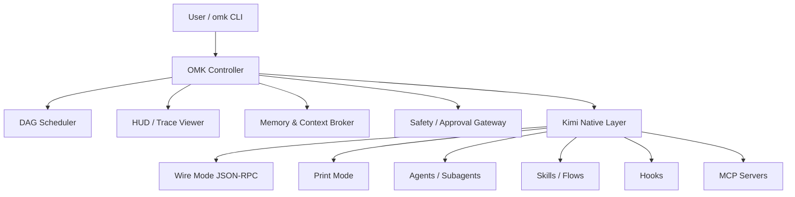

<div align="center">


<h1>oh-my-kimichan</h1>

<p>
  <strong>Turn Kimi Code CLI into a worktree-based coding team</strong><br/>
  <sub>Multi-agent orchestration harness / DESIGN.md-aware UI / Live quality gates / AGENTS.md compatible</sub>
</p>

<p>
  <a href="https://github.com/dmae97/oh-my-kimichan/actions/workflows/ci.yml"></a>
  <a href="https://github.com/dmae97/oh-my-kimichan/releases"></a>
  <a href="https://www.npmjs.com/package/oh-my-kimichan"></a>
  <a href="https://www.npmjs.com/package/oh-my-kimichan"></a>
  <a href="https://github.com/dmae97/oh-my-kimichan/stargazers"></a>
  <a href="https://github.com/dmae97/oh-my-kimichan/network/members"></a>
  <a href="https://github.com/dmae97/oh-my-kimichan/issues"></a>
  <a href="./LICENSE"></a>
</p>

<p>
  
  
  
  
  
</p>

<p>
  <a href="#korean">Korean</a> /
  <a href="#english">English</a> /
  <a href="#chinese">Chinese</a> /
  <a href="#japanese">Japanese</a>
</p>

</div>

---

## Table of Contents

- [GitHub Release Snapshot](#github-release-snapshot)
- [Repository Topics](#repository-topics)
- [Korean](#korean)
- [English](#english)
- [Chinese](#chinese)
- [Japanese](#japanese)
- [Customization](#customization)
- [Acknowledgements](#acknowledgements)

---

## GitHub Release Snapshot

> **Current GitHub-ready version:** `0.2.2` — documented for the active open-source README branch.

| Area | GitHub-visible update | Why it matters |
|------|-----------------------|----------------|
| 16GB-friendly runtime | `runtime.resource_profile = "auto"` selects a lite profile on memory-constrained machines | Keeps OMK usable on 16GB laptops and WSL environments |
| DAG execution | Graphlib-inspired internal task graph validates missing deps, duplicate ids, cycles, and stable topological order | Faster, safer long-running agent orchestration without adding dependency weight |
| Role-aware ensemble | Coder/planner/architect/reviewer/QA/explorer nodes can run weighted candidate perspectives with quorum aggregation | Improves agent-call quality while keeping `max_parallel = 1` by default |
| Local graph memory | Project memory defaults to `.omk/memory/graph-state.json` with ontology mindmap and GraphQL-lite recall | Local-first memory works without external Neo4j setup |
| Built-in LSP | `omk lsp typescript` exposes the bundled TypeScript language server | Helps coding agents and editors share the same language intelligence |
| Quality gates | `npm run check`, `npm test`, `npm run lint`, `npm run build` are wired into CI and release checks | GitHub contributors can verify changes before PRs |

### GitHub Markdown checklist

- [x] GitHub Actions / package version / npm / stars / forks / issues badges are visible at the top.
- [x] Mermaid architecture diagrams render in GitHub-flavored Markdown.
- [x] Repository topic badges below match the recommended GitHub topics.
- [x] README logo PNG display width increased to `720px` for a stronger GitHub landing page.

## Repository Topics

These topics are also mirrored in `package.json` keywords for npm/GitHub discoverability.

<p>
  
  
  
  
  
  
  
  
  
  
  
  
  
  
  
  
  
  
  
  
</p>

Recommended GitHub topics:

```txt
kimi, kimi-cli, kimi-code, kimi-k2, ai-agent, coding-agent, multi-agent, agentic-coding, orchestration, dag, task-graph, ensemble, mcp, model-context-protocol, lsp, typescript, nodejs, cli, developer-tools, worktree
```

---

<h2 id="korean">Korean</h2>

> Kimi Code CLI를 <strong>worktree 기반 코딩 팀</strong>으로 변환하세요. DESIGN.md 기반 UI 생성, AGENTS.md 호환성, 실시간 품질 게이트를 제공합니다.

### Features

| Feature | Description |
|---------|-------------|
| Kimi K2.6 Optimized | Kimi K2.6에 특화된 워크플로우와 컨텍스트 관리 |
| Okabe + D-Mail | Kimi Code의 Okabe 스마트 컨텍스트 관리와 `SendDMail` 체크포인트 기본 활용 |
| Worktree-based Parallel Team | Git worktree로 에이전트별 격리된 작업 공간 제공 |
| DESIGN.md Integration | Google DESIGN.md 표준 기반 UI 생성 |
| Multi-Agent Compatible | AGENTS.md / GEMINI.md / CLAUDE.md 동시 지원 |
| Quality Gates | 완료 전 자동 lint, typecheck, test, build 검증 |
| Built-in LSP | `omk lsp typescript`로 번들 TypeScript language server 실행 |
| Live HUD | 작업자 상태, 테스트 결과, 리스크, 병합 현황 실시간 모니터링 |
| MCP Integration | 다양한 MCP 서버와의 원활한 연동 |
| Local Graph Memory | 프로젝트/세션별 기억을 `.omk/memory/graph-state.json` 온톨로지 그래프로 저장하고 mindmap/GraphQL-lite 제공 |
| OAuth Usage Badge | Kimi `context:` 상태줄 옆에 `/login` 계정, 5h quota, weekly quota 표시 |
| YOLO-by-default | 오픈소스 기본값은 `approval_policy = "yolo"`; secret/destructive hooks는 계속 차단 |
| Safety Hooks | yolo mode에서도 파괴적 명령어 및 비밀 유출 방지 기본 제공 |

### Install

```bash
npm install -g oh-my-kimichan
```

> **Requirements:** Node.js >= 20, Git, python3, Kimi CLI (v1.39.0+)

### Quick Start

```bash
omk init
omk doctor
omk chat
```

### Kimi-native context

oh-my-kimichan agents use an Okabe-compatible base agent that inherits `default` and adds `SendDMail`, so D-Mail is available for checkpoint rollback and context recovery. Use it before risky refactors, long-running handoffs, or `/compact`; durable facts still go to project-local ontology graph memory.

### Project-local graph memory

OMK stores project/session memory in `.omk/memory/graph-state.json` by default, decomposes notes into ontology nodes (`Goal`, `Decision`, `Task`, `Risk`, `Command`, `File`, `Evidence`, `Concept`), and exposes `omk_memory_mindmap` plus `omk_graph_query` for GraphQL-lite access. External Neo4j remains optional.

The interactive wrapper also augments Kimi’s native `context:` status line with a masked OAuth account plus 5-hour and weekly usage/quota. See `docs/kimi-oauth-usage-status.md`.


### Preview

```bash
$ omk doctor
OK Node.js           v22.14.0
OK Git               2.49.0
OK Python            3.13.2
OK tmux              3.5a
OK Kimi CLI          v1.39.0
OK Scaffold          .omk/, .kimi/skills/ found

$ omk team
Team Runtime starting...
   [architect]  Creating plan.md...
   [coder]      Implementation in progress...
   [reviewer]   Code review done
   [qa]         Tests passed
```

### CLI Commands

#### Stable

| Command | Description |
|---------|-------------|
| `omk init` | Scaffold .omk/, .kimi/skills/, .agents/skills/, docs, hooks, agents |
| `omk doctor` | Check Node, Kimi CLI, Git, python3, tmux, scaffold |
| `omk chat` | Interactive Kimi with agent/config/MCP auto-detection |
| `omk plan <goal>` | Plan-only mode |
| `omk run <flow> <goal>` | Flow-based task execution |
| `omk lsp [server]` | Built-in LSP launcher; default server is TypeScript |
| `omk design init` | Create DESIGN.md with frontmatter |
| `omk design list` | List local/remote DESIGN.md files |
| `omk design apply <name>` | Convert DESIGN.md into code |
| `omk google stitch-install` | Install Google Stitch skills |
| `omk sync` | Sync Kimi assets |

#### Experimental

| Command | Status | Notes |
|---------|--------|-------|
| `omk team` | Layout only | tmux window layout scaffold |
| `omk merge` | Manual | Diff check + manual cherry-pick guidance |
| `omk hud` | Partial | Run status display |
| `omk design lint` | Stub | Validation not yet implemented |
| `omk design diff` | Stub | Diff not yet implemented |
| `omk design export` | Stub | Export not yet implemented |

### 🏗️ 아키텍처



### 🛡️ 안전

기본 훅은 파괴적 명령과 비밀 유출을 차단합니다:

- `.omk/config.toml`의 기본 approval policy는 오픈소스 자동화를 위해 `yolo`입니다.
- `pre-shell-guard.sh` — `rm -rf /`, `sudo`, `git push --force` 등 차단
- `protect-secrets.sh` — `.env` 편집 및 비밀 유출 차단
- `post-format.sh` — 수정된 파일 자동 포맷
- `stop-verify.sh` — 종료 시 최종 검증

### 🔌 내장 LSP

```bash
omk lsp --print-config
omk lsp --check
omk lsp typescript
```

`omk init`은 `.omk/lsp.json`을 생성하고, TypeScript/JavaScript 프로젝트에서 사용할 수 있는 번들 `typescript-language-server` 실행 경로를 제공합니다.

### 📄 라이선스

[MIT](./LICENSE)

---

<h2 id="english">English</h2>

> Turn Kimi Code CLI into a <strong>worktree-based coding team</strong> with DESIGN.md-aware UI generation, AGENTS.md compatibility, and live quality gates.

### Features

| Feature | Description |
|---------|-------------|
| Kimi K2.6 Optimized | Workflows and context management tailored for Kimi K2.6 |
| Okabe + D-Mail | Uses Kimi Code Okabe smart context management and `SendDMail` checkpoint recovery by default |
| Worktree-based Parallel Team | Git worktree provides isolated workspaces per agent |
| DESIGN.md Integration | UI generation based on Google DESIGN.md standard |
| Multi-Agent Compatible | Simultaneous support for AGENTS.md / GEMINI.md / CLAUDE.md |
| Quality Gates | Automated lint, typecheck, test, build verification before completion |
| Live HUD | Real-time monitoring of worker status, test results, risk, and merge state |
| MCP Integration | Seamless connection with various MCP servers |
| Local Graph Memory | Stores project/session memory in `.omk/memory/graph-state.json` as an ontology graph with mindmap/GraphQL-lite tools |
| Safety Hooks | Default protection against destructive commands and secret leakage |

### Install

```bash
npm install -g oh-my-kimichan
```

> **Requirements:** Node.js >= 20, Git, python3, Kimi CLI (v1.39.0+)

### Quick Start

```bash
omk init
omk doctor
omk chat
```

### Preview

```bash
$ omk doctor
OK Node.js           v22.14.0
OK Git               2.49.0
OK Python            3.13.2
OK tmux              3.5a
OK Kimi CLI          v1.39.0
OK Scaffold          .omk/, .kimi/skills/ found

$ omk team
Team Runtime starting...
   [architect]  Creating plan.md...
   [coder]      Implementation in progress...
   [reviewer]   Code review done
   [qa]         Tests passed
```

### CLI Commands

#### Stable

| Command | Description |
|---------|-------------|
| `omk init` | Scaffold .omk/, .kimi/skills/, .agents/skills/, docs, hooks, agents |
| `omk doctor` | Check Node, Kimi CLI, Git, python3, tmux, scaffold |
| `omk chat` | Interactive Kimi with agent/config/MCP auto-detection |
| `omk plan <goal>` | Plan-only mode |
| `omk run <flow> <goal>` | Flow-based task execution |
| `omk design init` | Create DESIGN.md with frontmatter |
| `omk design list` | List local/remote DESIGN.md files |
| `omk design apply <name>` | Convert DESIGN.md into code |
| `omk google stitch-install` | Install Google Stitch skills |
| `omk sync` | Sync Kimi assets |

#### Experimental

| Command | Status | Notes |
|---------|--------|-------|
| `omk team` | Layout only | tmux window layout scaffold |
| `omk merge` | Manual | Diff check + manual cherry-pick guidance |
| `omk hud` | Partial | Run status display |
| `omk design lint` | Stub | Validation not yet implemented |
| `omk design diff` | Stub | Diff not yet implemented |
| `omk design export` | Stub | Export not yet implemented |

### 🏗️ Architecture


### 🛡️ Safety

Default hooks block destructive commands and secret leakage:

- `pre-shell-guard.sh` — Blocks `rm -rf /`, `sudo`, `git push --force`, etc.
- `protect-secrets.sh` — Blocks `.env` edits and secret leakage
- `post-format.sh` — Auto-formats modified files
- `stop-verify.sh` — Final verification on stop

### 📄 License

[MIT](./LICENSE)

---

<h2 id="chinese">Chinese</h2>

> 将 Kimi Code CLI 转变为一个<strong>基于 worktree 的编码团队</strong>。支持 DESIGN.md 感知 UI 生成、AGENTS.md 兼容性以及实时质量门禁。

### Features

| Feature | Description |
|---------|-------------|
| Kimi K2.6 优化 | 专为 Kimi K2.6 定制的工作流与上下文管理 |
| Okabe + D-Mail | 默认使用 Kimi Code Okabe 智能上下文管理和 `SendDMail` 检查点恢复 |
| 基于 Worktree 的并行团队 | Git worktree 为每个 Agent 提供隔离工作空间 |
| DESIGN.md 集成 | 基于 Google DESIGN.md 标准的 UI 生成 |
| 多 Agent 兼容 | 同时支持 AGENTS.md / GEMINI.md / CLAUDE.md |
| 质量门禁 | 完成前自动执行 lint、typecheck、test、build 验证 |
| 实时 HUD | 实时监控工作者状态、测试结果、风险与合并状态 |
| MCP 集成 | 与多种 MCP 服务器无缝连接 |
| Local Graph Memory | 将项目/会话记忆存入 `.omk/memory/graph-state.json` 本地本体图，并提供 mindmap/GraphQL-lite |
| 安全钩子 | 默认防止破坏性命令与密钥泄漏 |

### Install

```bash
npm install -g oh-my-kimichan
```

> **要求：** Node.js >= 20、Git、python3、Kimi CLI (v1.39.0+)

### Quick Start

```bash
omk init
omk doctor
omk chat
```

### Preview

```bash
$ omk doctor
OK Node.js           v22.14.0
OK Git               2.49.0
OK Python            3.13.2
OK tmux              3.5a
OK Kimi CLI          v1.39.0
OK Scaffold          .omk/, .kimi/skills/ found

$ omk team
Team Runtime 启动中...
   [architect]  创建 plan.md...
   [coder]      实现进行中...
   [reviewer]   代码审查完成
   [qa]         测试通过
```

### CLI Commands

#### Stable

| Command | Description |
|---------|-------------|
| `omk init` | 创建 .omk/、.kimi/skills/、.agents/skills/、docs、hooks、agents 脚手架 |
| `omk doctor` | 检查 Node、Kimi CLI、Git、python3、tmux、脚手架 |
| `omk chat` | 支持代理/配置/MCP 自动检测的交互式 Kimi |
| `omk plan <goal>` | 仅计划模式 |
| `omk run <flow> <goal>` | 基于流程的任务执行 |
| `omk design init` | 创建带 frontmatter 的 DESIGN.md |
| `omk design list` | 列出本地/远程 DESIGN.md |
| `omk design apply <name>` | 将 DESIGN.md 转换为代码 |
| `omk google stitch-install` | 安装 Google Stitch 技能 |
| `omk sync` | 同步 Kimi 资源 |

#### Experimental

| Command | Status | Notes |
|---------|--------|-------|
| `omk team` | 仅布局 | tmux 窗口布局脚手架 |
| `omk merge` | 手动 | Diff 检查 + 手动 cherry-pick 指导 |
| `omk hud` | 部分 | 运行状态显示 |
| `omk design lint` | 占位 | 验证尚未实现 |
| `omk design diff` | 占位 | Diff 尚未实现 |
| `omk design export` | 占位 | 导出尚未实现 |

### 🏗️ 架构


### 🛡️ 安全

默认钩子阻止破坏性命令和密钥泄漏：

- `pre-shell-guard.sh` — 阻止 `rm -rf /`、`sudo`、`git push --force` 等
- `protect-secrets.sh` — 阻止 `.env` 编辑及密钥泄漏
- `post-format.sh` — 自动格式化修改的文件
- `stop-verify.sh` — 停止时的最终验证

### 📄 许可证

[MIT](./LICENSE)

---

<h2 id="japanese">Japanese</h2>

> Kimi Code CLI を <strong>worktree ベースのコーディングチーム</strong>に変換します。DESIGN.md 対応の UI 生成、AGENTS.md 互換性、ライブ品質ゲートを提供します。

### Features

| Feature | Description |
|---------|-------------|
| Kimi K2.6 対応 | Kimi K2.6 に特化したワークフローとコンテキスト管理 |
| Okabe + D-Mail | Kimi Code Okabe のスマートコンテキスト管理と `SendDMail` チェックポイント復旧を標準利用 |
| Worktree ベース並列チーム | Git worktree でエージェントごとに分離された作業空間を提供 |
| DESIGN.md 連携 | Google DESIGN.md 標準に基づく UI 生成 |
| マルチエージェント互換 | AGENTS.md / GEMINI.md / CLAUDE.md を同時サポート |
| 品質ゲート | 完了前に自動 lint、typecheck、test、build を検証 |
| ライブ HUD | ワーカー状態、テスト結果、リスク、マージ状況をリアルタイム監視 |
| MCP 統合 | 様々な MCP サーバーとのシームレスな連携 |
| Local Graph Memory | プロジェクト/セッション記憶を `.omk/memory/graph-state.json` のローカル ontology graph に保存し、mindmap/GraphQL-lite を提供 |
| 安全フック | 破壊的コマンドとシークレット漏洩をデフォルトで防止 |

### Install

```bash
npm install -g oh-my-kimichan
```

> **要件:** Node.js >= 20、Git、python3、Kimi CLI (v1.39.0+)

### Quick Start

```bash
omk init
omk doctor
omk chat
```

### Preview

```bash
$ omk doctor
OK Node.js           v22.14.0
OK Git               2.49.0
OK Python            3.13.2
OK tmux              3.5a
OK Kimi CLI          v1.39.0
OK Scaffold          .omk/, .kimi/skills/ found

$ omk team
Team Runtime 開始中...
   [architect]  plan.md 作成中...
   [coder]      実装進行中...
   [reviewer]   コードレビュー完了
   [qa]         テスト通過
```

### CLI Commands

#### Stable

| Command | Description |
|---------|-------------|
| `omk init` | .omk/、.kimi/skills/、.agents/skills/、docs、hooks、agents のスキャフォールドを作成 |
| `omk doctor` | Node、Kimi CLI、Git、python3、tmux、スキャフォールドを診断 |
| `omk chat` | エージェント/設定/MCP 自動検出対応の対話型 Kimi |
| `omk plan <goal>` | 計画専用モード |
| `omk run <flow> <goal>` | フローベースのタスク実行 |
| `omk design init` | frontmatter 付き DESIGN.md を作成 |
| `omk design list` | ローカル/リモート DESIGN.md を一覧表示 |
| `omk design apply <name>` | DESIGN.md をコードに変換適用 |
| `omk google stitch-install` | Google Stitch スキルをインストール |
| `omk sync` | Kimi アセットを同期 |

#### Experimental

| Command | Status | Notes |
|---------|--------|-------|
| `omk team` | レイアウトのみ | tmux ウィンドウ レイアウト スキャフォールド |
| `omk merge` | 手動 | Diff 確認 + 手動 cherry-pick ガイダンス |
| `omk hud` | 部分的 | 実行状態の表示 |
| `omk design lint` | スタブ | 検証は未実装 |
| `omk design diff` | スタブ | Diff は未実装 |
| `omk design export` | スタブ | エクスポートは未実装 |

### 🏗️ アーキテクチャ


### 🛡️ セーフティ

デフォルトのフックは破壊的コマンドとシークレットの漏洩をブロックします：

- `pre-shell-guard.sh` — `rm -rf /`、`sudo`、`git push --force` などをブロック
- `protect-secrets.sh` — `.env` の編集とシークレットの漏洩をブロック
- `post-format.sh` — 変更ファイルの自動フォーマット
- `stop-verify.sh` — 停止時の最終検証

### 📄 ライセンス

[MIT](./LICENSE)

---

<h2 id="customization">Customization</h2>

### 🎨 Custom Welcome Banner Image

You can override Kimi CLI's default ASCII banner with your own image:

1. Place your image in the project root (e.g. `kimichan.png`).
2. Add to `.omk/config.toml`:

```toml
[theme]
logo_image = "kimichan.png"
```

- Supports **PNG**, **JPEG**, and **GIF**.
- Relative paths are resolved from the project root; absolute paths (including Windows `C:\...` or `M:\...`) work too.
- In **iTerm**, **Kitty**, **WezTerm**, and other graphics-capable terminals, the image renders in full resolution.
- In standard terminals, it falls back to high-quality ANSI block art via `terminal-image`.
- If the image is missing or rendering fails, the built-in ASCII art is used automatically.

---

<h2 id="acknowledgements">Acknowledgements</h2>

This project is built on top of amazing open-source work:

- Kimi Code CLI by Moonshot AI - The foundation that makes everything possible
- Google DESIGN.md - Design specification standard for UI generation
- Commander.js - Elegant command-line interfaces
- Zod - TypeScript-first schema validation
- tmux - Terminal multiplexer for team runtime

<div align="center">
  <sub>Built with love for the Kimi ecosystem</sub>
</div>
